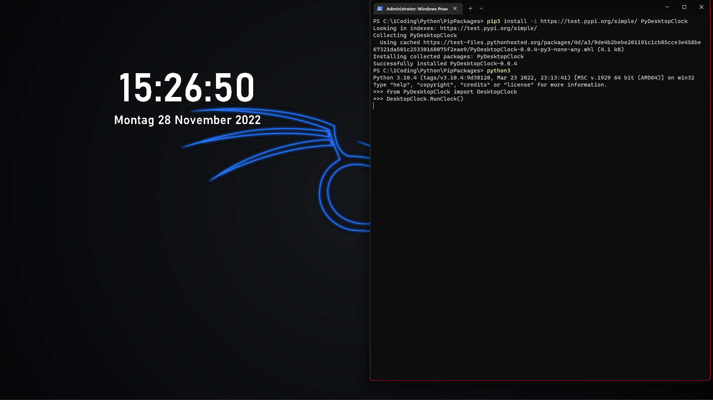

# PyDesktopClock #

>This is a pip package for a windows widget that display a clock.

## Usage ##

> To use this clock just install it with.
>
> ```CMD
>   pip install -i https://test.pypi.org/simple/ PyDesktopClock
>```
>
> or
>
> ```CMD
>   pip3 install -i https://test.pypi.org/simple/ PyDesktopClock
>```
>
> After u finished intalling you can import the clock in a python file
>
>```py
>from PyDesktopClock import DesktopClock
>
>DesktopClock.RunClock()
>```
>
> Run the script and a Clock should apper on your display

### Keybinds ###

> - Press F12 to exit the clock
> - Press F9 to go to configuration where you can lock the window on screen and change the color of the displayed time
>
> 